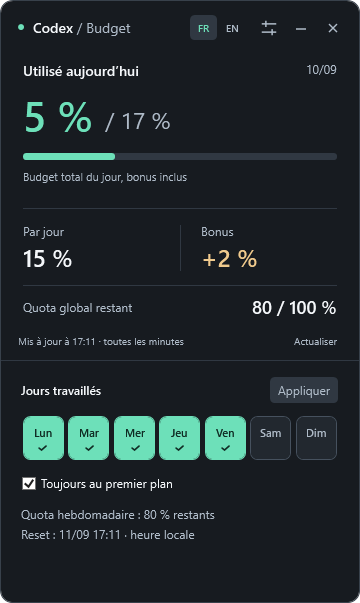
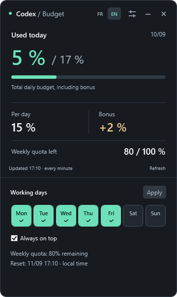

# Budget Codex

**Keep track of your Codex budget, one workday at a time.**
**Gardez votre budget Codex en vue, jour après jour.**

[English](#english) · [Français](#français)

*Demo figures · Chiffres de démonstration*

## English

*Demo figures.*

Budget Codex is a small Windows desktop widget that helps you plan your Codex usage until the next weekly reset. Choose your working days and keep your daily budget, carryover and remaining weekly quota in view.

### At a glance

- **Daily usage:** see how much you have used against your daily allowance, including carryover — for example, **5% / 17%**.
- **Your work schedule:** select the days you work. Five days gives a daily target of **20%**; seven days gives approximately **14.3%**.
- **Bonus:** see unused budget carried forward from earlier days.
- **Weekly quota:** see what remains out of **100%**, directly at the bottom of the widget.
- **Automatic updates:** refreshes every minute while open, with a manual refresh button.

### Get started

You need Windows, Codex installed and signed in, and an account whose weekly usage limit is available to Codex.

1. Download [Budget-Codex-Setup.exe](dist/Budget-Codex-Setup.exe) and open it.
2. Click **Install**. The installer adds desktop and Start menu shortcuts, then opens the widget. No commands, Python installation or administrator access are needed.
3. Open **Réglages** (the sliders button), select your working days and click **Appliquer**.

The installer uses English or French according to Windows. If Codex is missing, the launcher explains what to install first. To update, close the widget and run the new installer; your history is kept. To remove it, close the widget and uninstall **Budget Codex** from Windows Settings → Apps. Local history is retained for a future reinstall.

This build is not code-signed, so Windows may display a publisher or reputation warning. Only open installers obtained from a source you trust.

Drag the header to move the widget. You can keep it on top of other windows, minimize it or close it. Your schedule, history and position are saved. It does not start automatically with Windows.

**Choose FR or EN beside the settings button.** The interface switches immediately and remembers your choice. On first launch it follows your Windows language (French or English).

### Understanding your budget

The daily target divides the weekly 100% across your selected working days. Bonus is unused allowance carried forward within the same reset cycle; it is **not extra quota granted by OpenAI**. For example, a 15% daily target plus 2% carried over gives a 17% allowance.

If the start of the day was not recorded, the main figure switches to **Disponible aujourd’hui** (available today). It uses the budget unlocked by your work schedule minus total usage in the current cycle. This is a planning balance, not a reconstruction of usage since midnight. With seven working days, two days unlocked and 17% used, the planning balance is approximately **11.57%**, with **83%** remaining overall.

Figures follow the precision and refresh timing provided by Codex. Days and reset times automatically follow your **Windows time zone**, including daylight saving time. A time-zone change is picked up at the next refresh. History is regrouped by local day; the actual reset instant stays unchanged. The widget helps you plan; it does not stop Codex when you reach your target.

### Your data

History and preferences are stored locally in the widget’s `data` folder. Usage is read through your installed Codex application; the monitor does not make model requests. Monitoring pauses when the widget is closed or the PC sleeps. If a reading cannot be refreshed, the widget shows an offline state and retries automatically.

Budget Codex is an independent project, not an official OpenAI product. It opens as a separate desktop window, rather than adding a panel inside Codex.

Looking for the version you use inside a Codex conversation? See the [on-demand plugin](../plugins/codex-budget/README.md).

## Français

Budget Codex est un petit widget Windows pour organiser votre consommation Codex jusqu’au prochain renouvellement hebdomadaire. Choisissez vos jours de travail et gardez votre budget du jour, votre bonus et votre quota restant sous les yeux.

### L’essentiel en un regard

- **Consommation du jour :** visualisez votre utilisation sur le budget disponible, bonus inclus — par exemple **5 % / 17 %**.
- **Votre planning :** choisissez vos jours de travail. Cinq jours donnent un objectif de **20 % par jour** ; sept jours, environ **14,3 %**.
- **Bonus :** retrouvez le budget non utilisé reporté des jours précédents.
- **Quota hebdomadaire :** consultez le restant sur **100 %**, directement en bas du widget.
- **Actualisation automatique :** les données sont mises à jour chaque minute lorsque le widget est ouvert, ou avec le bouton **Actualiser**.

### Bien démarrer

Il vous faut Windows, Codex installé avec votre compte connecté, et une limite hebdomadaire accessible dans Codex.

1. Téléchargez [Budget-Codex-Setup.exe](dist/Budget-Codex-Setup.exe) et ouvrez-le.
2. Cliquez sur **Installer**. Un raccourci est ajouté sur le bureau et dans le menu Démarrer, puis le widget s’ouvre. Aucune commande, installation de Python ou autorisation administrateur n’est nécessaire.
3. Ouvrez **Réglages** avec le bouton à curseurs, sélectionnez vos jours de travail et cliquez sur **Appliquer**.

L’installateur utilise le français ou l’anglais selon Windows. Si Codex manque, un message explique ce qu’il faut installer. Pour une mise à jour, fermez le widget et lancez le nouvel installateur : votre historique est conservé. Pour le supprimer, fermez-le et désinstallez **Budget Codex** dans Paramètres Windows → Applications. L’historique local reste disponible pour une réinstallation.

Cette version n’est pas signée numériquement : Windows peut afficher un avertissement concernant l’éditeur ou la réputation du fichier. N’ouvrez que les installateurs provenant d’une source de confiance.

Déplacez le widget par sa barre de titre. Vous pouvez le garder au premier plan, le réduire ou le fermer. Votre planning, votre historique et votre position sont conservés. Le lancement au démarrage de Windows n’est pas automatique.

**Choisissez FR ou EN à côté du bouton des réglages.** La langue change immédiatement et votre choix est conservé. Au premier lancement, le widget suit la langue de Windows : français, ou anglais pour les autres langues.

### Comprendre les chiffres

Le budget journalier répartit les 100 % hebdomadaires sur vos jours de travail. Le bonus correspond au budget non utilisé reporté au sein du même cycle : **ce n’est pas du quota supplémentaire offert par OpenAI**. Par exemple, un objectif quotidien de 15 % avec 2 % reportés donne un budget de 17 %.

Si le début de journée n’a pas été enregistré, le chiffre principal devient **Disponible aujourd’hui**. Il correspond au budget débloqué par votre planning, moins la consommation globale du cycle. C’est un solde de planning, pas une reconstitution de l’utilisation depuis minuit. Avec sept jours travaillés, deux jours débloqués et 17 % consommés, ce solde est d’environ **11,57 %**, avec **83 %** restants au total.

La précision et la fraîcheur des chiffres dépendent des relevés fournis par Codex. Les journées et les horaires de renouvellement suivent automatiquement le **fuseau horaire de Windows**, avec les changements d’heure. Un changement de fuseau est pris en compte à la prochaine actualisation. L’historique est regroupé selon les journées locales ; l’instant réel du renouvellement ne change pas. Le widget vous aide à gérer votre budget ; il ne bloque pas Codex lorsque vous atteignez votre objectif.

### Vos données

L’historique et les préférences sont conservés localement dans le dossier `data` du widget. Le suivi lit les limites via votre application Codex installée, sans faire de requête à un modèle. Il se met en pause lorsque le widget est fermé ou que le PC est en veille. Si un relevé échoue, le widget indique qu’il est hors ligne et réessaie automatiquement.

Budget Codex est un projet indépendant, non officiel et non affilié à OpenAI. Il s’ouvre dans une fenêtre séparée sur le bureau.

Vous cherchez la version à utiliser dans une conversation Codex ? Consultez le [plugin à la demande](../plugins/codex-budget/README.md).
