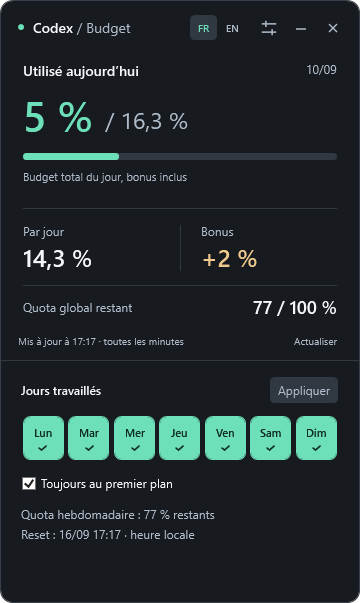
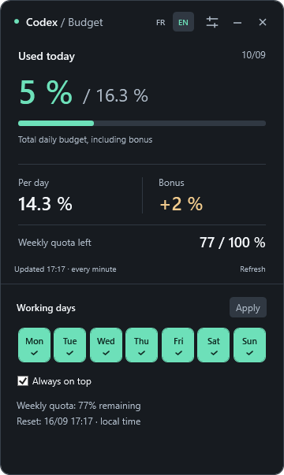

# Budget Codex

**Version 1.2.11 — actual remaining quota:** today's budget is the remaining weekly quota divided among working days from today to the exact reset. Example: 33% left on Wednesday, Saturday off, reset Saturday → 11% each for Wednesday, Thursday and Friday. Past spending is already included in the remaining quota; no extra bonus or deficit is applied. Days left replaces the old deficit display. The estimate is recalculated as usage changes. Tomorrow assumes no more usage today; “at this pace” subtracts projected usage first. Partial reset days are weighted; later-cycle days are excluded.

**Version 1.2.11 — quota réel restant :** le budget du jour répartit le quota hebdomadaire restant entre les jours travaillés d’aujourd’hui au reset exact. Exemple : 33 % le mercredi, samedi décoché, reset samedi → 11 % pour mercredi, jeudi et vendredi. La consommation passée est déjà comprise dans le quota restant : aucun bonus ou malus supplémentaire. La case Jours restants remplace le malus. Le montant évolue avec la consommation. Demain suppose aucun usage supplémentaire aujourd’hui ; la projection au rythme moyen en déduit d’abord l’usage prévu. Les journées coupées par le reset sont pondérées ; les jours du cycle suivant sont exclus.

**Keep track of your Codex budget, one workday at a time.**
**Gardez votre budget Codex en vue, jour après jour.**

[English](#english) · [Français](#français)

| Français | English |
| :---: | :---: |
|  |  |

*Demo figures: 7 working days = about 14.3% per day. / Démonstration : 7 jours travaillés = environ 14,3 % par jour.*

## English

Budget Codex is a small Windows desktop widget that helps you plan your Codex usage until the next weekly reset. Choose your working days and keep your daily budget, carryover and remaining weekly quota in view.

### Codex and Spark

Switch between **Codex** and **GPT-5.3-Codex-Spark** above the daily budget. Your selection is saved. Each model has its own weekly history and daily carryover; workdays are shared. Spark also shows its **5-hour remaining quota and reset time**, independently of its weekly budget. These two percentages are never added together. An exhausted 5-hour window can limit Spark even when its weekly quota remains available. If your account does not expose Spark limits, the widget shows unavailable values rather than guessing.

### At a glance

### Codex CLI support

The Windows Codex CLI is supported, including npm installations. The desktop Codex app is optional. Sign in using `codex login`, then open the widget. It reads account-wide quotas, so app and CLI usage on the same account are included together, not shown as separate counters. API-key billing is not tracked. WSL-only installations are supported: if no Windows Codex executable is found, the widget searches installed Linux distributions (such as Debian or Ubuntu), skipping Docker distributions. It uses the first installation found and the distribution’s default Linux user. Sign in inside that distribution, for example with `wsl -d Debian` followed by `codex login`.

Detection follows Windows PATH order (native executable or npm package), then the default user npm folder, then the desktop app bundle. The widget uses that installation's account and inherited `CODEX_HOME`; a different CLI profile may use a different account. After changing PATH, restart the widget; after signing in, click Refresh.

WSL detection checks the Linux login PATH, common user installation folders and nvm. Hover over the connection status to see the source (Windows or WSL / distribution). Windows takes priority when both are installed; quotas are not merged across accounts. A WSL probe may start a stopped distribution. The widget closes its own server connection, without shutting down WSL. **To use Debian even when Codex is installed on Windows:** open Settings → Quota source → WSL / Debian. The choice is saved and reconnects automatically, without clicking Apply. Automatic retains Windows priority; explicit Windows or WSL choices never fall back to another installation. Restart the widget after adding a new distribution. Custom Linux users are not supported.

### Get started

You need Windows, Codex installed and signed in, and an account whose weekly usage limit is available to Codex.

1. Download [Budget-Codex-Setup.exe](dist/Budget-Codex-Setup.exe) and open it.
2. Click **Install**. The installer adds desktop and Start menu shortcuts, then opens the widget. No commands, Python installation or administrator access are needed.
3. Open **Réglages** (the sliders button), select your working days and click **Appliquer**.

The installer uses English or French according to Windows. If Codex is missing or signed out, the widget displays instructions and retries automatically. To update, close the widget and run the new installer; your history is kept. To remove it, close the widget and uninstall **Budget Codex** from Windows Settings → Apps. Local history is retained for a future reinstall.

This build is not code-signed, so Windows may display a publisher or reputation warning. Only open installers obtained from a source you trust.

Drag the header to move the widget. You can keep it on top of other windows, minimize it or close it. Your schedule, history and position are saved. It does not start automatically with Windows.

**Choose FR or EN beside the settings button.** The interface switches immediately and remembers your choice. On first launch it follows your Windows language (French or English).

### Understanding your budget

If the start of the day was not recorded, the main figure switches to **Disponible aujourd’hui** (available today). It uses the budget unlocked by your work schedule minus total usage in the current cycle. This is a planning balance, not a reconstruction of usage since midnight. With seven working days, two days unlocked and 17% used, the planning balance is approximately **11.57%**, with **83%** remaining overall.

Figures follow the precision and refresh timing provided by Codex. Days and reset times automatically follow your **Windows time zone**, including daylight saving time. A time-zone change is picked up at the next refresh. History is regrouped by local day; the actual reset instant stays unchanged. The widget helps you plan; it does not stop Codex when you reach your target.

If the CLI provides quotas without an account identifier, the widget still displays the weekly and Spark 5-hour limits. Daily planning uses the current global quota and your workdays. Those unidentified readings are not added to account history, so usage since midnight and historical carryover cannot be reconstructed in this mode.

### Report a problem

Open Settings and scroll to **Diagnostics**. The read-only console shows connection steps, the selected source, unavailable quotas and error codes. Click **Copy report** and include it with your bug report. The report contains the widget version, time zone and up to 40 recent events from the current monitor session. It does not include raw server messages, authentication tokens, account emails or conversation content. A new session starts when the monitor restarts.

### Your data

History and preferences are stored locally in the widget’s `data` folder. Usage is read through your installed Codex executable (CLI or desktop bundle); the monitor does not make model requests. Monitoring pauses when the widget is closed or the PC sleeps. If a reading cannot be refreshed, the widget shows an offline state and retries automatically.

Budget Codex is an independent project, not an official OpenAI product. It opens as a separate desktop window, rather than adding a panel inside Codex.

Looking for the version you use inside a Codex conversation? See the [on-demand plugin](../plugins/codex-budget/README.md).

## Français

Budget Codex est un petit widget Windows pour organiser votre consommation Codex jusqu’au prochain renouvellement hebdomadaire. Choisissez vos jours de travail et gardez votre budget du jour, votre bonus et votre quota restant sous les yeux.

### Codex et Spark

Le sélecteur au-dessus du budget permet de choisir **Codex** ou **GPT-5.3-Codex-Spark**. Votre choix est mémorisé. Chaque modèle possède son historique hebdomadaire et son report journalier ; les jours de travail sont communs. Spark affiche aussi son **quota restant sur 5 heures et son reset**, indépendamment du budget hebdomadaire. Ces deux pourcentages ne sont jamais additionnés. La limite de 5 heures peut bloquer Spark même si sa réserve hebdomadaire n’est pas épuisée. Si votre compte ne fournit pas les limites Spark, le widget les indique comme indisponibles.

### L’essentiel en un regard

### Prise en charge du CLI Codex

Le CLI Codex pour Windows est pris en charge, y compris les installations npm. L’application Codex est facultative. Connectez-vous avec `codex login`, puis ouvrez le widget. Les quotas couvrent le compte : les usages de l’application et du CLI sur le même compte sont inclus ensemble, sans compteurs séparés. La facturation par clé API n’est pas suivie. Les installations uniquement dans WSL sont prises en charge : si aucun exécutable Codex Windows n’est trouvé, le widget cherche dans les distributions Linux installées (Debian, Ubuntu…), en ignorant celles de Docker. Il utilise la première installation trouvée et l’utilisateur Linux par défaut de la distribution. Connectez-vous dans cette distribution, par exemple avec `wsl -d Debian`, puis `codex login`.

La détection suit l’ordre du PATH Windows (exécutable natif ou paquet npm), puis le dossier npm utilisateur par défaut, puis le binaire de l’application. Le widget utilise le compte de cette installation et le `CODEX_HOME` hérité ; un autre profil CLI peut utiliser un autre compte. Après modification du PATH, relancez le widget ; après connexion, cliquez sur Actualiser.

La détection WSL vérifie le PATH de connexion Linux, les dossiers utilisateur habituels et nvm. Survolez l’état de connexion pour voir la source (Windows ou WSL / distribution). Windows reste prioritaire si les deux sont installés ; les quotas de comptes différents ne sont pas fusionnés. La recherche peut démarrer une distribution arrêtée. Le widget ferme sa propre connexion serveur sans arrêter WSL. **Pour utiliser Debian même si Codex est installé sous Windows :** ouvrez Réglages → Source des quotas → WSL / Debian. Le choix est mémorisé et reconnecte automatiquement, sans cliquer sur Appliquer. Automatique garde la priorité Windows ; un choix explicite Windows ou WSL ne bascule jamais vers une autre installation. Relancez le widget après ajout d’une distribution. Le choix d’un autre utilisateur Linux n’est pas proposé.

### Bien démarrer

Il vous faut Windows, Codex installé avec votre compte connecté, et une limite hebdomadaire accessible dans Codex.

1. Téléchargez [Budget-Codex-Setup.exe](dist/Budget-Codex-Setup.exe) et ouvrez-le.
2. Cliquez sur **Installer**. Un raccourci est ajouté sur le bureau et dans le menu Démarrer, puis le widget s’ouvre. Aucune commande, installation de Python ou autorisation administrateur n’est nécessaire.
3. Ouvrez **Réglages** avec le bouton à curseurs, sélectionnez vos jours de travail et cliquez sur **Appliquer**.

L’installateur utilise le français ou l’anglais selon Windows. Si Codex manque, un message explique ce qu’il faut installer. Pour une mise à jour, fermez le widget et lancez le nouvel installateur : votre historique est conservé. Pour le supprimer, fermez-le et désinstallez **Budget Codex** dans Paramètres Windows → Applications. L’historique local reste disponible pour une réinstallation.

Cette version n’est pas signée numériquement : Windows peut afficher un avertissement concernant l’éditeur ou la réputation du fichier. N’ouvrez que les installateurs provenant d’une source de confiance.

Déplacez le widget par sa barre de titre. Vous pouvez le garder au premier plan, le réduire ou le fermer. Votre planning, votre historique et votre position sont conservés. Le lancement au démarrage de Windows n’est pas automatique.

**Choisissez FR ou EN à côté du bouton des réglages.** La langue change immédiatement et votre choix est conservé. Au premier lancement, le widget suit la langue de Windows : français, ou anglais pour les autres langues.

### Comprendre les chiffres

Si le début de journée n’a pas été enregistré, le chiffre principal devient **Disponible aujourd’hui**. Il correspond au budget débloqué par votre planning, moins la consommation globale du cycle. C’est un solde de planning, pas une reconstitution de l’utilisation depuis minuit. Avec sept jours travaillés, deux jours débloqués et 17 % consommés, ce solde est d’environ **11,57 %**, avec **83 %** restants au total.

La précision et la fraîcheur des chiffres dépendent des relevés fournis par Codex. Les journées et les horaires de renouvellement suivent automatiquement le **fuseau horaire de Windows**, avec les changements d’heure. Un changement de fuseau est pris en compte à la prochaine actualisation. L’historique est regroupé selon les journées locales ; l’instant réel du renouvellement ne change pas. Le widget vous aide à gérer votre budget ; il ne bloque pas Codex lorsque vous atteignez votre objectif.

Si le CLI fournit les quotas sans identifiant de compte, le widget affiche tout de même les limites hebdomadaires et les 5 heures Spark. Le budget du jour est calculé à partir du quota global et des jours travaillés. Ces relevés ne sont pas ajoutés à un historique de compte : la consommation depuis minuit et le report historique ne peuvent pas être reconstitués dans ce mode.

### Signaler un problème

Ouvrez les réglages et descendez jusqu’à **Diagnostic**. La console en lecture seule affiche les étapes de connexion, la source choisie, les quotas indisponibles et les codes d’erreur. Cliquez sur **Copier le rapport** et joignez-le à votre signalement. Le rapport contient la version du widget, le fuseau horaire et jusqu’à 40 événements récents de la session du moniteur. Les messages bruts du serveur, jetons de connexion, adresses e-mail du compte et conversations sont exclus. Une nouvelle session commence au redémarrage du moniteur.

### Vos données

L’historique et les préférences sont conservés localement dans le dossier `data` du widget. Le suivi lit les limites via votre application Codex installée, sans faire de requête à un modèle. Il se met en pause lorsque le widget est fermé ou que le PC est en veille. Si un relevé échoue, le widget indique qu’il est hors ligne et réessaie automatiquement.

Budget Codex est un projet indépendant, non officiel et non affilié à OpenAI. Il s’ouvre dans une fenêtre séparée sur le bureau.

Vous cherchez la version à utiliser dans une conversation Codex ? Consultez le [plugin à la demande](../plugins/codex-budget/README.md).

## Development / Développement

See [BUILDING.md](BUILDING.md) to build and test the widget. / Consultez [BUILDING.md](BUILDING.md) pour compiler et tester le widget.

## License / Licence

[MIT](LICENSE) — Copyright © 2026 Webn-Benjamin.

### Tomorrow’s budget / Budget de demain

The **Tomorrow** card shows the planned allowance at the start of tomorrow, assuming no further usage today. It includes overspending and carryover, respects days off and is capped by the actual weekly quota remaining. If the weekly reset occurs before tomorrow, the widget waits for the new quota. Quotas refresh every 15 seconds when connected; upstream Codex reporting may lag.

La carte **Demain** indique le budget prévu au début de demain si vous ne consommez plus aujourd’hui. Elle tient compte du malus, du report et des jours de repos, sans dépasser le quota hebdomadaire réel restant. Si le reset intervient avant demain, le widget attend le nouveau quota. Actualisation toutes les 15 secondes lorsque la connexion fonctionne ; les données remontées par Codex peuvent avoir du retard.

**Tomorrow at this pace** estimates tomorrow's available budget if this week's average usage continues until tonight. The average divides current cycle usage by elapsed working-day equivalents (including partial days and schedule history). It requires at least one elapsed working day, assumes no extra usage on days off and never predicts a new reset quota. This is an estimate, not measured future usage.

**Demain à ce rythme** estime le budget disponible demain si la consommation moyenne de la semaine se poursuit jusqu’à ce soir. La moyenne divise la consommation du cycle par les jours travaillés écoulés, pondérés pour les journées partielles et selon l’historique du planning. Il faut au moins une journée travaillée écoulée. Aucune consommation supplémentaire n’est supposée les jours de repos, ni aucun nouveau quota après reset. Il s’agit d’une estimation.